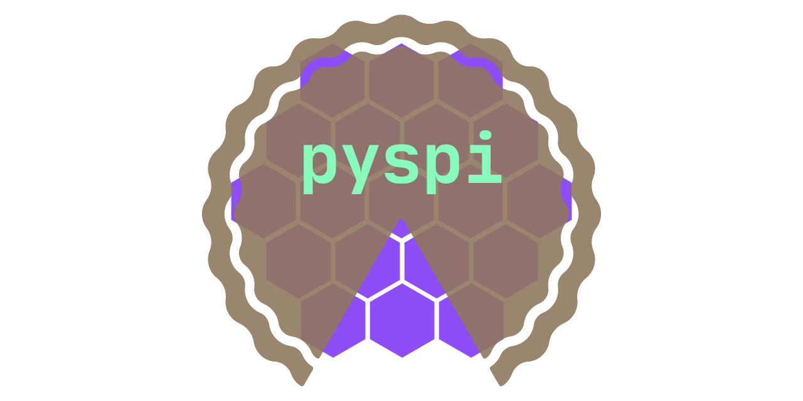

.. pySPI documentation master file, created by
   sphinx-quickstart on Sun Feb  4 11:24:43 2018.
   You can adapt this file completely to your liking, but it should at least
   contain the root `toctree` directive.

Welcome to PySpi's documentation!
====================================

PySpi is pure python interface to analyze Integral/SPI data. At the moment it allows to fit transient and constant point source and we want to include extended sources soon.

It provides plugins for [3ML](https://threeml.readthedocs.io/en/stable/) and therefore all the spectral models from [astromodels](https://astromodels.readthedocs.io/en/latest/) are available for the fits. Check out these two software packages for more information.

This is still not a stable version. Bugs will occure sometimes, please open an issue on github if you find one.

.. toctree::
   :maxdepth: 2
   :hidden:

   notebooks/installation.ipynb
