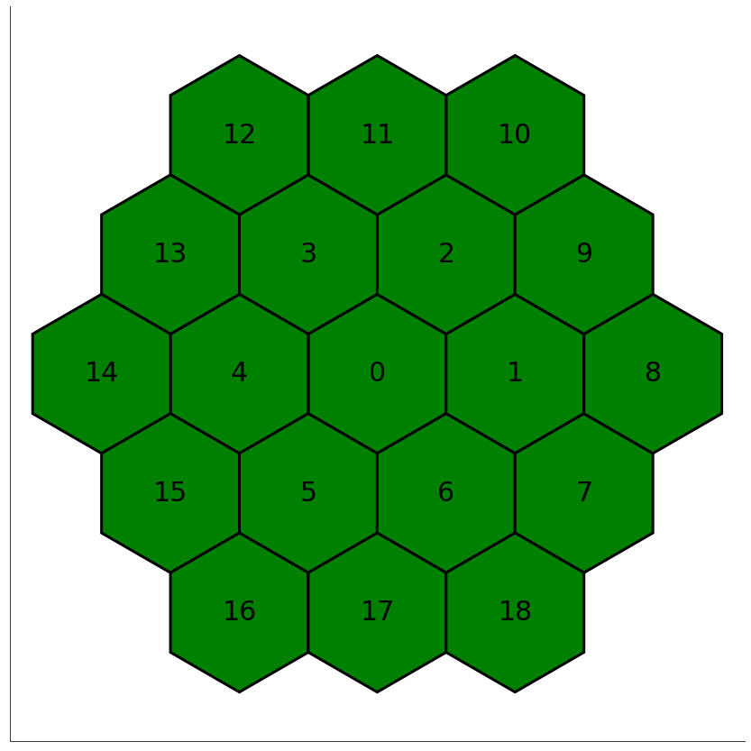

# Summary

PySPI is a newly developed pure python analysis framework for 
Gamma-Ray Burst (GRB) data from the spectrometer (SPI) onboard the 
International Gamma-Ray Astrophysics Laboratory (INTEGRAL). The INTEGRAL 
satellite is a gamma-ray observatory hosting four instruments that 
operate in the energy range between 3 keV and 10 MeV. It was launched in 
2002 and is still working today. The main goals of PySPI are to provide 
an easy to install and develop analysis software for SPI, which includes 
improvements on the statistical analysis of GRB data.

At the moment it can only analyze transient sources. One interesting example of 
transient sources are GRBs, which are extremely bright but short flashes 
of Gamma-Rays, with a typical duration between a few ms and a few hundred seconds. They are
believed to be produced by the collapse of massive stars at the end of their lifetime and
the merger of compact objects, like for example Neutron-Stars. In the future we plan to add support for other types of sources than transients, such as persistent point sources as well as extended emission.

# Statement of need

The main analysis tool to analyze SPI data up to now is the
"Off-line Scientific Analysis" (OSA) [@osa], which are maintained by
the INTEGRAL Science Data Centre (ISDC). While they are comprehensive
in their capabilities for manipulating data obtained from all
instrument on-board INTEGRAL, they exist as an IDL interface to a
variety of low-level C++ libraries. While there are containerized 
versions of OSA now available, the modern workflow of simply installing 
the software from a package manager and running on a local workstation is 
not possible and often students rely on a centralized installation which 
must be maintained by a seasoned expert. Moreover, adding more sophisticated 
and/or correct data analysis methods to the software requires an expertise 
that is not immediately accessible to junior researchers or non-experts in 
the installation of OSA. Also due to the
increased computational power that is available today compared to that
of 20 years ago, many of the analysis methods can be improved.

PySPI addresses both these problems: It is providing an easy to install 
software, that can be developed further by everyone who wants to participate. 
It also allows Bayesian fits of the data with true forward folding of the physical spectra 
into the data space via the response. This improves the sensitivity 
and the scientific output of GRB analyses with INTEGRAL/SPI. 

# SPectrometer on INTEGRAL (SPI)

SPI is a coded mask instrument covering the energy range between 20 keV and 8 MeV. It consists of a detector plane with 19 Germanium detectors and a mask plane 1.7 meters above the detectors with 3 cm thick tungsten elements. The mask produces a unique shadow pattern on the detectors depending on the source position. This information can be used to create an image from the observation. Also SPI has an excellent energy resolution of 2.5 keV at 1.3 MeV, which makes SPI an ideal instrument to analyze spectral features, such as lines. 

# Procedure

To analyze GRB data, PySPI accepts inputs such as the time of the GRB
and the spectral energy bins that will used in an analysis. With this
information, it automatically downloads all the data files required
for a specific analysis. These files are used to construct a response 
and a time series for the observation that contains the GRB time, which 
can be used to select active time intervals for the source that should 
be used in the fits, and time intervals before and after the 
GRB signal for background estimation. After this has been done, a plugin 
for `3ML` [@3mlpaper;@3ML] can be constructed. This allows for all the benefits the 3ML 
framework offers like the modeling framework `astromodels` [@astromodels], joined 
fits with other instruments, many different Bayesian samplers and much more. 
In the [documentation](https://pyspi.readthedocs.io/en/latest/) there is an
[example](https://pyspi.readthedocs.io/en/latest/notebooks/grb_analysis/)
for this workflow procedure.

# Acknowledgments

B. Biltzinger acknowledges financial support from the `German Aerospaces Center (Deutsches Zentrum für Luft- und Raumfahrt, DLR)` under FKZ 50 0R 1913. 

# References

